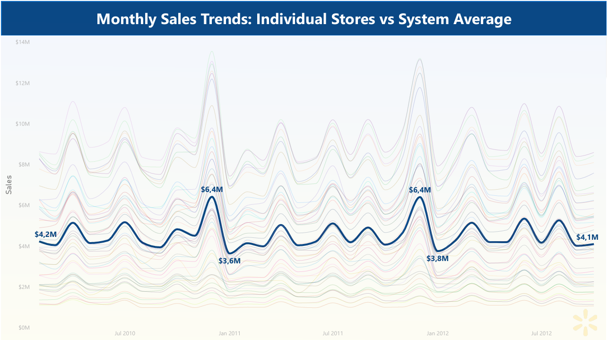
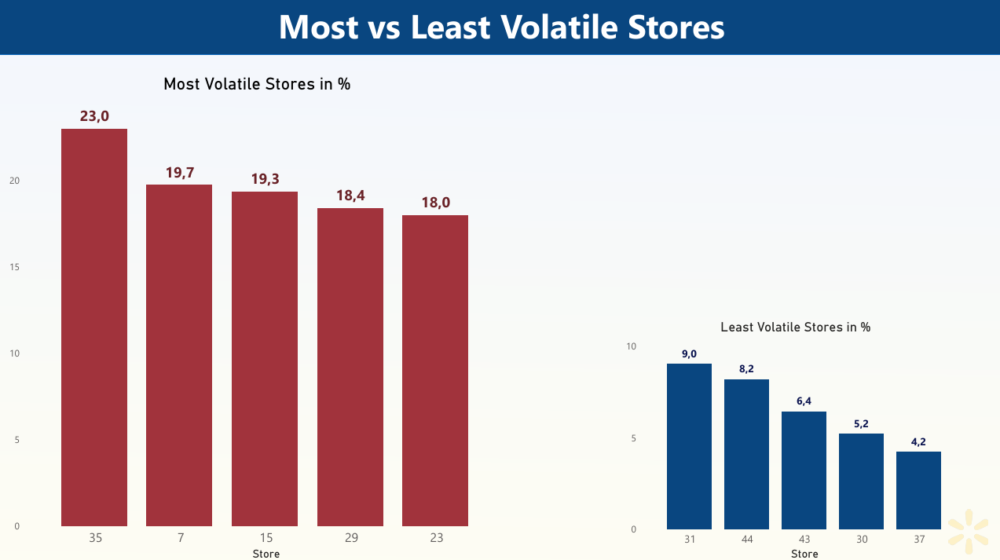

# **Walmart Sales Case Study**

## **Executive Summary**:

**Objektiv**:  
Diese Case Study analysiert, wie verschiedene Faktoren die wöchentliche Verkaufsleisting von **45 Walmart Filialen** beeinflussen.  

**Daten Überblick**:  
Die Analyse basiert auf den wöchentlichen Verkaufsdaten von Walmart aus **2010–2012** (Kaggle), einschließlich Filialumsätzen, Feiertagen, CPI, Kraftstoffpreisen, Arbeitslosenquote und Temperatur.  

**Key Insights**:  
1. Saisonale Spitzen: Die Daten zeigen, dass das Q4 Feiertagsfenster **(25. Nov – 25. Dez)** der wichtigste Umsatztreiber ist, mit **$308 Mio**. im Jahr 2010 und **$314 Mio**. im Jahr 2011.
2. Resilienz gegenüber externen Faktoren: Die Analyse zeigt, dass die Korrelationen zwischen Umsatz und externen Faktoren wie CPI, Kraftstoffpreisen und Temperatur nahe null liegen. Die stärkste Beziehung besteht zur Arbeitslosenquote **(-0,11)**, was jedoch ebenfalls eine sehr schwache negative Korrelation ist. Das deutet darauf hin, dass Walmarts **„Everyday Low Price“** Strategie relativ robust gegenüber externen wirtschaftlichen und Umweltfaktoren ist.

**Empfehlungen**:  
1. Lagerbestände und Personal vor der Q4-Feiertagssaison erhöhen
2. Marketing- und Promotionskampagnen gezielt in saisonalen Spitzphasen priorisieren

### **Aufgabe**:  

#### *Analysiere, wie verschiedene Faktoren die wöchentliche Verkaufsperformance von 45 Walmart Filialen beeinflussen*

Dieses interaktive Power BI Dashboard visualisiert die Verkaufsperformance über **45 Filialen** hinweg und zeigt einen Gesamtumsatz von **6,7 Mrd. $**, mit deutlichen saisonalen Peaks während der Feiertage.  
Durch die Analyse der Korrelationen zwischen Umsatz und externen Faktoren wie CPI, Kraftstoffpreisen und Temperatur wird deutlich, dass diese makroökonomischen Einflüsse nur geringe Auswirkungen auf den Kernumsatz von Walmart haben.  

  

### **Methodologie**:
1. Datensatz extrahiert & organisiert, Datenstruktur und Variablen überprüft
2. Datenqualität mit dem ROCCC-Framework bewertet (Relevant, Objective, Complete, Consistent, Current)
3. NULL Werte und Duplikate geprüft, Datenkonsistenz und validität in SQL sichergestellt
4. Korrelationen und Varianz berechnet und benötigte Daten für Dashboards über SQL Queries extrahiert
5. Einfache und interaktive Dashboards in Power BI erstellt

### **Skills**:
  SQL: Datenvalidierung, Trendanalyse, CTEs & Daten-Transformation  
  Power BI: Datenaufbereitung, Erstellung interaktiver Dashboards und Datenvisualisierung  
  PowerPoint: Gestaltung von einfachen, verständlichen Präsentationen mit Fokus auf Key Insights  
  Jupyter Notebook: Markdown Dokumentation  

**Quick SQL Code**:
```
-- AUFGABE 13: Korrelation zwischen Weekly Sales und Temperature, Fuel_Price, CPI und Unemployment berechnen und View erstellen
----------------------------------------------------------------
CREATE OR REPLACE VIEW `walmartproject-03.Walmart_Dataset.Sales_vs_MacroeconomicFactors_Correlation`
AS
  SELECT
    ROUND(CORR(Weekly_Sales, Temperature), 2) AS temperature_to_sales_corr,
    ROUND(CORR(Weekly_Sales, Fuel_Price), 2) AS fuel_price_to_sales_corr,
    ROUND(CORR(Weekly_Sales, CPI), 2) AS CPI_to_sales_corr,
    ROUND(CORR(Weekly_Sales, Unemployment), 2) AS unemployment_to_sales_corr
  FROM 
    `walmartproject-03.Walmart_Dataset.Walmart_Sales`;
----------------------------------------------------------------
```

### **Ergebnisse und Empfehlungen**:
Die Analyse zeigt, dass das Q4 Feiertagsfenster **(25. Nov – 25. Dez)** der wichtigste Treiber der jährlichen Sales-Leistung ist. In diesem Zeitraum steigen die Verkäufe deutlich über den Jahresdurchschnitt, was die starke Bedeutung der saisonalen Nachfrage klar bestätigt.  

Zusätzlich zeigt die Analyse, dass externe wirtschaftliche und Umweltfaktoren wie Temperatur, Spritzpreise und CPI nur sehr schwache Korrelationen mit den Sales haben, also kaum messbaren Einfluss. Die stärkste (aber trotzdem sehr schwache) Beziehung besteht noch zur Arbeitslosenrate (Unemployment Rate).  

Diese Ergebnisse deuten darauf hin, dass die **"Everyday Low Price"** Strategie von Walmart hilft, eine stabile Nachfrage unabhängig von externen wirtschaftlichen Schwankungen zu halten. 

1. Dashboard überblick vom Leistungsstärkste Filiale (**Store 20**) 


---

2. Sales Trendline mit Fokus auf Ferienzeitsauswirkungen (**25. Nov – 25. Dez**)


---

3. Vergleich zwischen **System Durchschnitt** und **Individuele Filiale**



---

4. Volatilitätsanalyse von Filialen. **Am stärksten und am wenigsten** volatile Filialen  



**Key Insights**:  
• Sales steigen stark im Zeitraum **25. Nov – 25. Dez**  
• Ferienzeit ist der größte Treiber für Jährliche Umsatz, daher extrem wichtig für Planung  
• CPI, Fuel Prices, Temperature und Unemployment zeigen sehr schwache Korrelationen zu Weekly Sales  

**Empfehlungen**:  
• Inventar und Personalesetzung vor dem Q4 Ferienzeitfenster deutlich erhöhen  
• Gezielte Marketing- und Promotionsmaßnahmen genau in den Spitzenwochen einsetzen  
• Top Fililen (z.B. Filiale 20) analysieren und beste Methoden auf andere Standorte übertragen  
• Low-performing bzw. volatile Filialen gezielt verbessern und stabilisieren  
• Saisonale Trends für Marketingbudget, Promotion-Timing und Lagerverteilung nutzen  
• Prognose jährlich aktualisieren, um saisonale Veränderungen sauber abzubilden  

### **Nächste Schritte**:
•	Mehr aktuelle Verkaufsdaten integrieren, um Trends realistischer abzubilden  
• Filialen Merkmale (Standort, Große, Demografie) hinzufügen für tiefere Analyse  
• Externe Faktoren wie Promotionen, Konkurrenzaktivität oder lokale Veranstaltungen ergänzen  
• Insights direkt in Inventar, Personalbesetzung und Marketingplanung einbauen (vor allem Q4)  
• Echtzeit-Dashboards für Sales, Saisonalität und externe Faktoren aufsetzen  
  
